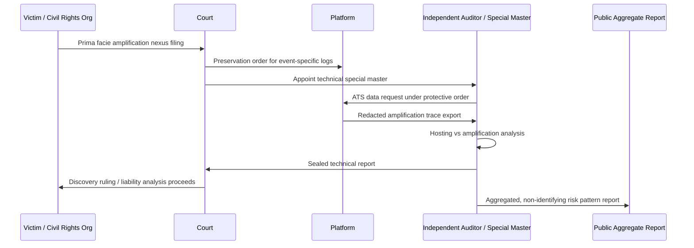
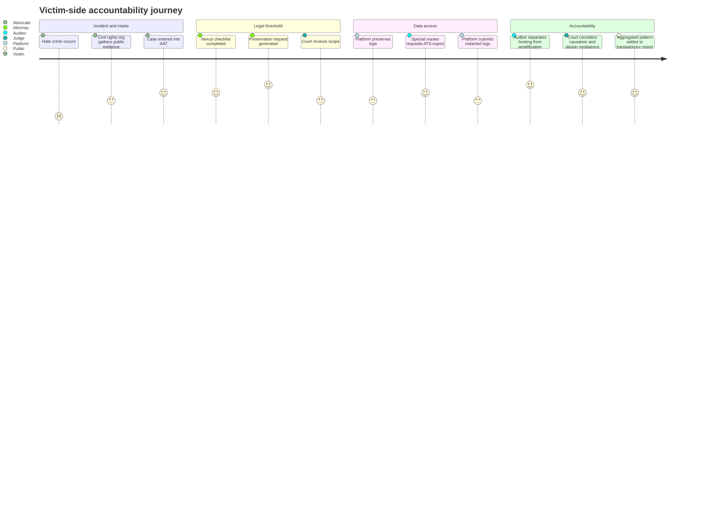

# Algorithmic Amplification Accountability  
## 추천 알고리즘이 오프라인 혐오범죄로 이어지는 경로에 대한 소시오테크니컬 개입 설계

**Course:** Design and/of Policy  
**Project type:** Final Group Design Project Draft  
**Team:** `[팀명 / 팀원 이름 입력]`  
**Date:** 2026-04-21  

---

## 0. Executive Summary

이 프로젝트의 출발점은 “소셜미디어 알고리즘이 양극화, 에코체임버, 혐오와 불관용을 만든다”는 넓은 문제의식이었다. 그러나 최종 프로젝트의 목표가 단순한 비판이 아니라 **정책 환경 안에서 작동 가능한 디자인 개입**을 제안하는 것이라면, 문제를 더 좁혀야 한다. 본 보고서는 세 현상을 분리한다.

- **Echo chambers**: 누가 어떤 정보에 노출되는가의 문제
- **Polarization**: 노출 이후 태도와 정체성이 어떻게 변하는가의 문제
- **Hate and offline harm**: 온라인 콘텐츠와 추천 구조가 실제 피해, 특히 혐오범죄와 어떻게 연결되는가의 문제

세 영역 중 정책·디자인 개입의 근거가 가장 분명한 것은 세 번째이다. 특히 Müller와 Schwarz는 독일 난민 위기 국면에서 Facebook 침투율이 높은 지역일수록 반난민 폭력 사건이 증가했고, Facebook 또는 인터넷 장애 시 그 효과가 약화되는 패턴을 통해 플랫폼 사용과 오프라인 혐오범죄 사이의 인과적 관계를 제시했다 [R1]. 영국 사례에서도 온라인 혐오 표현과 오프라인 인종·종교 혐오범죄 사이의 시간적·공간적 연관성이 관찰되었다 [R14]. Myanmar/Rohingya 사례는 추천·확산·콘텐츠 관리 실패가 집단폭력 환경에서 얼마나 치명적일 수 있는지를 보여주는 극단적 사례다 [L9].

따라서 우리의 문제 정의는 “알고리즘이 사람들을 전반적으로 양극화한다”가 아니다. 보다 좁고 검증 가능한 문제는 다음과 같다.

> **플랫폼의 개인화 추천 및 순위화 시스템이 민족·인종·종교 집단에 대한 적대적 콘텐츠를 ‘유기적 도달 범위’ 이상으로 증폭시키고, 그 증폭이 특정 오프라인 혐오범죄와 합리적으로 연결될 때, 현재의 법·기술·제도는 피해자가 그 증폭 경로를 입증하고 책임을 물을 수 있는 절차를 거의 제공하지 않는다.**

본 프로젝트는 이 문제를 해결하기 위해 **Amplification Accountability Toolkit, AAT**를 제안한다. AAT는 단일 앱이 아니라 법적·기술적·제도적 산출물이 결합된 소시오테크니컬 디자인이다. 핵심은 플랫폼에 사전 검열 의무를 부과하는 것이 아니라, 오프라인 혐오범죄가 발생한 뒤 피해자·민권단체·주 검찰총장·법원이 **알고리즘 증폭 경로를 표준화된 방식으로 요청, 보전, 분석, 공개**할 수 있도록 하는 것이다.

AAT의 네 구성요소는 다음과 같다.

1. **Amplification Trace Standard, ATS**: 플랫폼이 법원 보호명령 하에 제출해야 하는 추천 로그·노출 경로·순위 신호·안전 조치 이력의 최소 데이터 스키마.
2. **Evidence Docket Builder**: 피해자 측 변호인, 민권단체, 주 검찰총장이 사건의 1차 연결고리를 정리하고 법원에 discovery 요청을 제출하도록 돕는 인터페이스.
3. **Court-Supervised Audit Workflow**: 법원이 임명한 technical special master 또는 독립 감사인이 로그를 검토하고, 플랫폼의 “hosting”과 “amplification”을 구분하는 절차.
4. **Narrow Section 230 Amendment / Model Clause**: 제3자 콘텐츠 호스팅 면책은 유지하되, 플랫폼의 개인화 추천이 연방법상 혐오범죄와 연결되는 경우에는 제한적으로 민사책임 심리를 가능하게 하는 조항.

이 설계는 직접적인 “hate speech reporting mandate”가 아니다. 미국 맥락에서 정부가 플랫폼에게 특정 발화 범주를 감시·보고하게 하는 방식은 First Amendment와 compelled speech 문제를 강하게 유발한다 [L2], [L4]. AAT는 그 대신 **사후적, 법원 감독, 사건 특정적, 증거 중심** 메커니즘을 채택한다. 책임의 초점은 “유해한 말이 존재했다”가 아니라 “플랫폼이 자사의 추천·순위화·알림·자동재생 구조를 통해 해당 콘텐츠의 도달과 반복 노출을 얼마나 증폭했는가”에 있다.

---

## 1. Project Overview

### 1.1 Sociotechnical system studied

우리가 분석하는 시스템은 대형 소셜미디어 플랫폼의 **engagement-optimized recommender system**이다. Facebook, YouTube, TikTok, X와 같은 플랫폼은 사용자가 팔로우한 계정 또는 검색한 콘텐츠만 보여주지 않는다. 이들은 클릭, 체류 시간, 재공유, 댓글, 분노 반응, 네트워크 구조, 광고 수익 예측 등을 통해 콘텐츠를 순위화하고 추천한다. 이러한 추천 시스템은 단순한 기술 기능이 아니라 다음 요소가 결합된 사회기술적 인프라이다.

- **기술적 요소**: 랭킹 모델, 추천 모델, 자동재생, 알림, 공유 버튼, 그룹 추천, 트렌딩 모듈, 콘텐츠 moderation classifier
- **경제적 요소**: 광고 기반 수익모델, 체류 시간 최적화, 사용자 유지율, viral growth
- **제도적 요소**: Trust & Safety 팀, 정책 집행 가이드라인, 외주 moderation labor, 내부 risk review
- **법적 요소**: 미국 Section 230 면책, First Amendment 제약, 연방·주 혐오범죄법, 민사소송 discovery, EU DSA식 위험평가·감사 모델
- **사회적 요소**: 인종·민족·종교적 편견, 집단 정체성, 극단주의 네트워크, 피해 공동체의 정보 비대칭

이 시스템의 핵심 문제는 추천 알고리즘이 단지 “콘텐츠를 보여주는 도구”가 아니라 **도달 범위, 반복 노출, 네트워크 연결, 사회적 정당성의 분배자**로 작동한다는 점이다. Winner의 표현을 빌리면 기술적 인공물은 정치성을 가질 수 있으며 [R27], Bowker와 Star가 말하듯 분류·표준·인프라는 보이지 않는 방식으로 권력관계를 고정한다 [R29]. 추천 시스템은 어떤 발화를 ‘보이는 것’으로 만들고 어떤 피해를 ‘측정 불가능한 것’으로 남기는 인프라다.

### 1.2 Policy knot identified

본 프로젝트의 policy knot은 **알고리즘 증폭의 책임은 플랫폼이 만들지만, 그 증거와 권한은 피해자가 접근할 수 없고, 규제는 표현의 자유와 Section 230 면책에 막히는 구조**이다.

정리하면 다음과 같다.

| 얽힘 | 현재 상태 | 왜 knot인가 |
|---|---|---|
| 플랫폼 설계와 오프라인 피해 | 플랫폼은 추천·순위화·알림 구조를 설계하지만, 오프라인 혐오범죄의 비용은 피해자·지역사회·정부가 부담한다. | 책임과 비용이 분리된다. 플랫폼은 engagement benefit을 얻고, 피해자는 evidence access를 얻지 못한다. |
| Section 230과 알고리즘 추천 | 47 U.S.C. §230은 제3자 콘텐츠에 대한 플랫폼 면책을 제공한다 [L1]. | 추천 알고리즘이 단순 hosting인지, 플랫폼의 독자적 conduct/speech인지 법적으로 불안정하다. Gonzalez에서는 대법원이 Section 230 쟁점을 회피했다 [L3]. |
| First Amendment와 플랫폼 규제 | Moody v. NetChoice는 플랫폼의 콘텐츠 큐레이션이 표현적 판단일 수 있음을 강하게 시사했다 [L4]. | 정부가 “ethnic hate” 같은 범주를 직접 감시·보고하게 만들면 검열·compelled speech 논란이 생긴다. |
| 피해자와 데이터 접근 | 혐오범죄 피해자는 플랫폼 내부 로그, 추천 경로, ranking signal, downranking 이력을 볼 수 없다. | 인과관계 입증에 필요한 자료는 플랫폼만 보유한다. 피해자는 손해를 경험하지만 증거를 보유하지 않는다. |
| 투명성과 영업비밀 | 플랫폼은 알고리즘 로그와 모델을 영업비밀·보안·프라이버시 이유로 공개하지 않는다. | 전면 공개는 어렵지만, 완전 비공개는 accountability를 불가능하게 한다. |
| 법원과 기술 전문성 | 법원은 discovery 권한이 있지만 recommender system의 기술적 구조를 해석할 표준이 부족하다. | 기술 자료가 제출돼도 무엇을 요구하고 어떻게 검토할지 모르면 책임 심리가 형식화된다. |

이 knot의 특징은 단일 규제로 풀리지 않는다는 것이다. 콘텐츠 삭제법만으로는 First Amendment 문제가 생기고, 플랫폼 자율규제만으로는 정보 비대칭이 유지되며, 순수 기술 audit만으로는 피해자 구제와 법적 책임이 생기지 않는다. 따라서 개입도 법, 인터페이스, 데이터 표준, oversight workflow가 함께 설계되어야 한다.

### 1.3 Proposed intervention

우리가 제안하는 개입은 **Amplification Accountability Toolkit, AAT**이다. AAT는 플랫폼이 혐오표현을 사전에 검열하도록 강제하지 않는다. 대신, 다음 조건이 충족될 때 **알고리즘 증폭 경로를 소송·감사 가능한 형태로 보전하고 제출**하도록 한다.

1. 연방법 또는 주법상 혐오범죄가 발생했거나 민사상 상당한 피해 청구가 제기된다.
2. 원고 또는 공적 집행기관이 가해자가 특정 플랫폼 콘텐츠에 반복적으로 노출되었고, 그 노출이 검색·팔로우만이 아니라 추천 시스템을 통해 이루어졌을 가능성을 1차적으로 제시한다.
3. 법원 또는 지정된 독립 감사인이 보호명령 하에 플랫폼 로그 제출 범위를 정한다.
4. 플랫폼은 ATS 스키마에 따라 사건 관련 추천·노출·순위화·신고·moderation 이력을 제출한다.
5. 감사인은 “organic reach”와 “algorithmic amplification above baseline”을 구분해 분석하고, 법원은 그 결과를 causation, negligence, design defect, injunctive relief 판단에 활용한다.

### 1.4 Intended impact

AAT의 직접적 목표는 “소셜미디어에서 혐오를 없애는 것”이 아니다. 보다 실질적인 목표는 다음이다.

- 피해자와 민권단체가 플랫폼 내부 증거에 접근할 수 있는 절차를 만든다.
- 플랫폼이 recommendation design을 “소송에서 설명 가능한 시스템”으로 관리하도록 유도한다.
- 법원이 hosting과 algorithmic amplification을 구분해 판단할 수 있는 표준을 제공한다.
- 플랫폼의 과잉삭제 유인을 줄이기 위해 책임 범위를 “콘텐츠 존재”가 아니라 “증폭 설계와 사후적 인과관계”로 제한한다.
- DSA식 시스템 위험평가·감사 모델을 미국 맥락의 헌법적 제약에 맞게 변형한다 [L6], [L7].

---

## 2. Course Framing: Design and/of Policy

이 프로젝트는 수업의 핵심 전제, 즉 **디자인과 정책은 순차적이지 않고 상호 구성적이다**라는 관점에 맞춰져 있다. 추천 알고리즘은 시장에서 먼저 만들어지고 나중에 규제되는 중립적 기술이 아니다. 플랫폼은 특정 경제적 상상력—“더 많은 참여는 더 좋은 플랫폼이다”—을 제품 구조에 내장하고, 법은 그 구조를 Section 230 면책, 소송 절차, 플랫폼 자율규제, content moderation norms를 통해 안정화한다.

Jasanoff와 Kim의 sociotechnical imaginaries 개념은 기술 발전이 공적 목적과 사회적 미래에 대한 상상력을 함께 운반한다는 점을 설명한다 [R28]. 대형 플랫폼의 지배적 imaginary는 “개인화된 정보 흐름이 사용자의 자유로운 선택과 더 풍부한 참여를 만든다”는 것이다. 그러나 혐오범죄와 연결되는 알고리즘 증폭 사례는 다른 imaginary를 드러낸다. 여기서 개인화는 중립적 편의가 아니라 위험의 분배 장치이며, 추천 모델은 공동체 안전과 시민권 보호의 문제와 연결된다.

따라서 우리의 디자인 질문은 “더 좋은 recommender algorithm을 만들 수 있는가?”가 아니다. 질문은 다음과 같다.

> **정책, 법원, 피해 공동체, 플랫폼 내부 Trust & Safety, 독립 감사인이 추천 시스템의 위해성을 함께 다룰 수 있도록 어떤 증거 인프라와 governance interface를 설계할 것인가?**

이 관점에서 AAT는 다음 course themes를 직접 다룬다.

- **Infrastructure and governance:** 추천 로그, 랭킹 신호, moderation 이력은 accountability infrastructure다.
- **Platform governance:** 플랫폼은 Klonick이 말한 “new governors”처럼 사실상의 온라인 발화 규칙을 운영한다 [R18]. AAT는 그 사적 거버넌스를 공적 절차에 연결한다.
- **Risk and safety engineering:** NIST AI RMF의 Govern–Map–Measure–Manage 구조처럼 위험을 사후 설명 가능한 방식으로 관리한다 [L10].
- **Labor and automation:** 콘텐츠 moderation은 자동화와 인간 노동이 결합된 작업이며, Roberts가 보인 것처럼 그 노동은 보이지 않는 비용을 갖는다 [R24]. AAT는 단순히 “더 많이 삭제하라”가 아니라 어떤 설계·로그·감사 체계가 필요한지 묻는다.
- **Limits of technical fixes:** 단순한 counter-speech, feed 다양화, hate-speech classifier만으로는 법적 책임과 증거 접근의 문제를 해결하지 못한다.

---

## 3. Problem Definition: 왜 “algorithmic polarization” 전체가 아니라 “amplification-to-hate-crime pipeline”인가

### 3.1 넓은 polarization 담론의 한계

소셜미디어와 정치적 양극화의 관계는 실증적으로 복잡하다. Facebook 연구에서 Bakshy, Messing, Adamic은 사용자 네트워크와 개인 선택이 이념적으로 다양한 뉴스 노출을 제한하지만, 알고리즘만이 유일한 원인은 아니라고 보았다 [R3]. Bail 등은 반대 진영 견해 노출이 오히려 일부 사용자의 정치적 양극화를 증가시킬 수 있음을 보였다 [R4]. 2020년 미국 대선 기간 Meta 협력 실험에서는 Facebook/Instagram 피드를 역시간순으로 바꿔도 정치 태도나 양극화 지표가 크게 변하지 않는 결과가 보고되었다 [R5]. Nyhan 등도 like-minded source 노출이 많지만 단기적 태도 양극화 효과는 명확하지 않다고 보고했다 [R7].

이 문헌들은 “알고리즘이 곧바로 모든 정치적 양극화의 원인”이라는 주장을 약화시킨다. 그러나 이는 알고리즘이 무해하다는 뜻이 아니다. 오히려 연구들은 다음을 보여준다.

- 정보 노출과 engagement는 플랫폼 설계에 의해 크게 바뀐다 [R5], [R6], [R8].
- 도덕적 감정, 외집단 적대, 허위 정보는 확산에 유리한 구조를 가진다 [R9], [R10], [R11].
- 플랫폼 효과는 태도 전체보다 특정 행동, 특정 정보 경로, 특정 고위험 콘텐츠에서 더 명확할 수 있다 [R1], [R14].

따라서 최종 프로젝트의 범위를 “political polarization 전체”로 잡으면 너무 넓고, 정책 수단도 추상화된다. 반면 “algorithmic amplification of group-targeted hate leading to offline harm”는 좁지만 더 강한 증거와 더 명확한 제도적 개입점을 갖는다.

### 3.2 세 층위 분리

| 층위 | 질문 | 대표 문헌 | 개입 난이도 |
|---|---|---|---|
| Echo chambers | 사용자가 다양한 관점에 노출되는가? | Bakshy et al. [R3], Cinelli et al. [R2], González-Bailón et al. [R6] | 중간. 노출 다양화는 가능하지만 사용자 선택, 네트워크 동질성, 반발 효과가 존재한다. |
| Polarization | 노출이 태도·정체성·정서적 양극화를 바꾸는가? | Bail et al. [R4], Guess et al. [R5], Nyhan et al. [R7], Allcott et al. [R12] | 높음. 실험 결과가 맥락별로 다르고 효과가 단기·장기·플랫폼별로 불안정하다. |
| Hate/offline harm | 온라인 증폭이 특정 집단 대상 실제 피해와 연결되는가? | Müller & Schwarz [R1], Williams et al. [R14], UN Myanmar report [L9] | 상대적으로 낮음. 피해 정의와 법적 hook이 비교적 명확하다. |

우리의 설계는 세 번째 층위에 집중한다. 이는 양극화 연구를 무시하는 것이 아니라, 그 연구들이 보여주는 불확실성을 디자인 의사결정에 반영하는 것이다. 즉, 우리는 “사용자를 덜 양극화하자”라는 추상적 목표 대신, “오프라인 혐오범죄와 연결된 추천 증폭을 입증·감사·책임화할 수 있게 하자”는 구체적 목표를 선택한다.

### 3.3 Causal chain

본 프로젝트가 다루는 causal chain은 다음과 같다.

```mermaid
flowchart LR
    A[Engagement-optimized ranking] --> B[Higher visibility for moral-emotional / out-group hostile content]
    B --> C[Repeated exposure in vulnerable or extremist interpretive communities]
    C --> D[Normalization, grievance framing, target selection]
    D --> E[Offline hate incident / hate crime]
    E --> F[Victim seeks accountability]
    F --> G[Evidence gap: platform controls amplification logs]
    G --> H[Current legal knot: Section 230 + First Amendment + trade secrecy]
```



중요한 것은 AAT가 이 chain 전체를 자동으로 입증한다고 주장하지 않는다는 점이다. 인과관계는 사건별로 다르며 법정에서 높은 기준을 충족해야 한다. AAT의 역할은 **인과관계를 입증하기 위한 최소한의 증거 접근 구조**를 만드는 것이다. 지금의 문제는 원고가 이기기 어렵다는 것이 아니라, 원고가 무엇을 요구해야 하는지조차 표준화되어 있지 않다는 점이다.

---

## 4. Stakeholder and Power Analysis

### 4.1 Stakeholder map

| Stakeholder | Interests | Current power | Current vulnerability | AAT가 바꾸는 점 |
|---|---|---|---|---|
| 피해자와 표적 공동체 | 안전, 구제, 재발 방지, 증거 접근 | 낮음 | 피해를 입어도 플랫폼 내부 데이터를 볼 수 없음 | Evidence Docket Builder를 통해 prima facie case를 구조화하고 discovery 요청을 표준화 |
| 민권단체 | 전략소송, 공동체 보호, 정책개선 | 중간 | 플랫폼 데이터 접근 제한, 자원 부족 | 사건 패턴을 모으고 court-supervised audit을 요청할 수 있음 |
| 플랫폼 | 사용자 참여, 광고수익, 법적 면책, 신뢰 유지 | 매우 높음 | 규제·소송 리스크, 영업비밀 노출 우려 | 전면 공개 대신 보호명령·표준 스키마 기반 제한 공개로 예측 가능성 확보 |
| Trust & Safety 팀 | 위해 감소, 정책 집행, 내부 설득 | 중간 | 성장·수익 목표에 밀림, 외부 검증 부족 | 로그·risk assessment를 외부 절차와 연결해 내부 권한 강화 |
| 콘텐츠 moderator | 정책 집행, 업무 안정, 정신적 안전 | 낮음 | 과도한 삭제 압력, 불분명한 정책 | 삭제량 중심이 아니라 증폭 설계 중심의 위험 관리로 노동 부담 재구성 |
| 법원 | 공정한 증거 절차, 영업비밀 보호, 피해 구제 | 높음 | 기술 전문성 부족 | ATS와 technical special master workflow 제공 |
| 주 검찰총장 / 공공 집행기관 | 지역사회 안전, 소비자·시민권 보호 | 중간~높음 | Section 230와 First Amendment 제약 | 콘텐츠 규제가 아닌 제품 설계·증거 접근 중심 집행 가능 |
| 독립 연구자·감사인 | 데이터 접근, 공익 연구, 검증 | 중간 | 플랫폼 협조 없이는 데이터 부족 | DSA Article 40식 데이터 접근 원리를 미국식 소송·감사 절차에 응용 |

### 4.2 Power asymmetry

플랫폼은 추천 시스템 설계자이자 데이터 보유자이며, 동시에 potential defendant이다. 이중 지위는 accountability를 어렵게 만든다. Pasquale가 “black box society”라고 부른 문제처럼, 플랫폼은 사용자와 사회를 지속적으로 측정하지만 자신들의 핵심 의사결정은 비공개로 유지한다 [R25]. 피해자는 오프라인 harm을 경험하지만, 법적 causation을 입증할 데이터는 플랫폼 내부에 있다. 이 비대칭은 전형적인 policy knot이다.

AAT는 이 비대칭을 세 방식으로 줄인다.

1. **Data schema standardization:** 무엇을 요청할지 표준화한다.
2. **Procedural gatekeeping:** 무분별한 정보 요구가 아니라 법원 감독과 prima facie threshold를 둔다.
3. **Role separation:** 플랫폼, 피해자, 감사인, 법원의 권한을 분리한다.

---

## 5. Existing Policy Landscape

### 5.1 U.S. context: why direct hate-content reporting is fragile

미국에서 플랫폼에게 “ethnic hate amplification spike를 24시간 내 정부기관에 보고하라”는 식의 직접 의무를 부과하는 방안은 직관적으로 매력적이다. 플랫폼은 이미 velocity, engagement, reach metric을 추적하고 있고, 신고·자동분류 시스템도 갖고 있다. 그러나 미국 법제에서는 다음 문제가 크다.

1. **Compelled speech / compelled monitoring risk:** 정부가 특정 발화 범주를 정의하고 플랫폼에게 감시·보고하게 하면 표현의 자유 침해 논란이 발생한다.
2. **Definition problem:** “ethnic hate”를 정부가 정의할수록 사실상 speech regulation이 된다.
3. **Section 230 interaction:** 47 U.S.C. §230은 플랫폼이 제3자 콘텐츠의 publisher/speaker로 취급되는 것을 막는다 [L1].
4. **Editorial discretion:** Moody v. NetChoice에서 대법원은 플랫폼의 선택·배열·큐레이션이 표현적 판단이라는 관점을 강하게 인정했다 [L4].
5. **False positive problem:** hate speech, counterspeech, reporting about hate, news coverage, satire를 자동 metric만으로 구분하기 어렵다.

따라서 본 프로젝트는 미국 맥락에서는 **정부 보고 의무**가 아니라 **민사소송·법원 감독 discovery·제품설계 책임**의 경로를 택한다.

### 5.2 Section 230 and the recommendation question

Section 230의 핵심 문장은 플랫폼을 “another information content provider”가 제공한 정보의 publisher/speaker로 취급하지 않는다는 것이다 [L1]. 문제는 개인화 추천이 여기에 포함되는지다. Gonzalez v. Google은 YouTube 추천 알고리즘이 Section 230 면책을 받는지에 관한 중요한 사건이었지만, 대법원은 최종적으로 Section 230 질문을 직접 판단하지 않았다 [L3]. 이 때문에 법적 불확실성은 계속 남아 있다.

하지만 최근 판례들은 설계책임 경로를 완전히 닫지 않는다.

- **Lemmon v. Snap**: Ninth Circuit은 Snapchat Speed Filter와 reward system에 대한 negligent design claim이 특정 사용자 콘텐츠의 publisher liability가 아니라 제품 설계 문제라고 보아 Section 230으로 자동 차단되지 않는다고 판단했다 [L5].
- **Anderson v. TikTok**: Third Circuit은 TikTok For You Page 추천이 특정 맥락에서 플랫폼의 own expressive activity로 볼 수 있어 Section 230 면책으로 바로 차단되지 않는다고 판단했다 [L8].

이 판례들은 AAT의 법적 전략에 중요하다. AAT는 “플랫폼이 나쁜 말을 호스팅했다”가 아니라 “플랫폼이 위험한 증폭 제품을 설계·운영했고, 특정 사건에서 그 증폭 경로를 숨기지 말아야 한다”고 주장한다.

### 5.3 EU/Germany context as contrast, not direct transplant

EU Digital Services Act는 VLOP/VLOSE에게 systemic risk assessment, risk mitigation, independent audit, transparency reporting, vetted researcher data access를 요구한다 [L6], [L7]. DSA Article 34는 서비스의 design/functioning, including algorithmic systems에서 발생하는 systemic risk를 평가하도록 요구한다 [L6]. 이는 플랫폼 위험을 개별 콘텐츠 삭제가 아니라 시스템 수준에서 다루는 좋은 선례다.

Germany의 NetzDG는 불법 콘텐츠 신고·삭제와 transparency report 중심 모델을 제공했다 [L11]. 그러나 미국에 NetzDG식 모델을 그대로 이식하면 First Amendment 문제가 커진다. 따라서 본 프로젝트는 EU/독일 사례를 **정책적 영감**으로 삼되, 미국 맥락에서는 다음과 같이 변형한다.

- 사전 정부 보고가 아니라 사후 court-supervised discovery
- 콘텐츠 삭제 의무가 아니라 amplification trace disclosure
- hate speech 정의가 아니라 기존 hate crime statute와 사건 특정적 인과관계
- 일반 public disclosure가 아니라 보호명령·독립감사·집계 보고

---

## 6. Design Intervention: Amplification Accountability Toolkit, AAT

### 6.1 Design goals

AAT의 디자인 목표는 다음 다섯 가지다.

1. **Evidence access:** 피해자와 공익 집행자가 플랫폼 내부 추천 로그에 접근할 수 있도록 한다.
2. **Constitutional fit:** 정부가 발화를 사전에 감시·보고하게 만들지 않는다.
3. **Narrowness:** 혐오범죄와 같이 이미 법적으로 정의된 오프라인 harm에 한정한다.
4. **Design accountability:** 콘텐츠 자체보다 ranking, recommendation, notification, autoplay, group suggestion 같은 플랫폼 conduct를 분석한다.
5. **Practical implementability:** 플랫폼이 이미 보유한 로그와 trust & safety process를 재조직하는 방식으로 설계한다.

### 6.2 What AAT is

AAT는 세 층위의 산출물로 구성된다.

#### Layer 1. Interface prototype: Evidence Docket Builder

피해자 측 변호인, 민권단체, 주 검찰총장 사무실이 사건 정보를 입력하고 discovery request를 생성하는 인터페이스다.

주요 기능:

- 사건 기본정보 입력: 발생일, 장소, 혐오범죄 유형, 관련 법 조항
- 플랫폼 연결고리 입력: 가해자의 계정, 공개 게시물, manifesto, 좋아요·공유·댓글 기록, 언론 보도, 수사자료
- prima facie nexus checklist: 추천 노출 가능성, 시간적 근접성, 반복 노출, 플랫폼 신고 이력
- ATS discovery request 자동 생성
- 보호명령 템플릿 생성
- 독립 감사인 지정 요청서 생성

#### Layer 2. Data infrastructure: Amplification Trace Standard, ATS

ATS는 플랫폼이 제출해야 할 사건 특정적 로그 스키마다.

핵심 데이터 범주:

| Data field | Description | Why it matters |
|---|---|---|
| Content object ID | 사건 관련 콘텐츠의 내부 ID와 버전 기록 | 어떤 콘텐츠가 분석 대상인지 고정 |
| Exposure path | 콘텐츠가 검색, 팔로우, 그룹, 추천, 알림, 자동재생 중 어떤 경로로 노출되었는지 | hosting과 amplification 구분 |
| Impression log | 노출 시간, 빈도, 세션, 장치 유형, 지역 단위 집계 | 반복 노출과 시간적 근접성 분석 |
| Ranking position | feed/recommendation list에서의 위치 | 단순 존재와 우선순위화 구분 |
| Recommendation reason code | 협업필터링, 유사 사용자, 유사 콘텐츠, trending, engagement prediction 등 범주형 reason | 모델 영업비밀을 보호하면서 추천 논리 파악 |
| Organic baseline estimate | 팔로우/구독/검색/직접링크만으로 예상되는 도달 | “above-baseline amplification” 계산 |
| Safety history | 신고, downranking, removal review, classifier score, escalation 기록 | platform knowledge 또는 negligence 분석 |
| Velocity metrics | 시간당 조회·공유·댓글 증가율과 threshold crossing | rapid amplification 파악 |
| Counterfactual controls | 유사 콘텐츠 중 추천되지 않은 비교군의 집계 지표 | 증폭 효과 추정 |
| Redaction log | 삭제·익명화·집계 처리 내역 | 프라이버시와 영업비밀 보호 |

#### Layer 3. Governance/legal artifact: model liability clause

AAT의 장기 정책 제안은 Section 230에 대한 좁은 예외 조항이다. 초안은 다음과 같다.

> **Model Clause — Algorithmic Amplification and Federally Recognized Hate-Crime Harm**  
> Nothing in 47 U.S.C. §230 shall be construed to bar a civil action alleging that a provider of an interactive computer service materially amplified, through personalized recommendation, ranking, autoplay, notification, or group-suggestion systems, content that was a substantial factor in conduct constituting a hate crime under 18 U.S.C. §249, provided that the claim does not seek to impose liability solely for hosting, storing, or failing to remove third-party content, and provided that any discovery into recommendation systems shall be subject to protective orders safeguarding user privacy, trade secrets, and constitutionally protected expression.

이 조항의 의도는 Section 230을 전면 폐지하는 것이 아니다. 호스팅 면책은 유지하되, 플랫폼의 **affirmative amplification design**이 특정 법적 harm과 연결되는 경우에 한해 심리 가능성을 열어둔다. Citron과 Wittes가 주장한 “bad samaritan” 면책 제한 논의 [R22]와 Goldman이 경고한 Section 230 축소의 chilling effect [R23] 사이에서, 본 제안은 범위를 좁혀 과잉삭제와 법적 불확실성을 줄이려는 절충안이다.

### 6.3 How AAT changes existing dynamics

| Existing dynamic | AAT intervention | Expected shift |
|---|---|---|
| 피해자가 플랫폼 증거에 접근하지 못함 | Evidence Docket Builder + ATS discovery | 피해자 측이 표준화된 증거 요청 가능 |
| 플랫폼이 “우리는 콘텐츠를 만든 것이 아니다”라고 주장 | hosting vs amplification 구분 | 플랫폼 행위의 초점이 콘텐츠 존재에서 제품 설계로 이동 |
| 법원이 기술 자료를 이해하기 어려움 | technical special master workflow | 로그 제출·해석·요약의 절차화 |
| 플랫폼이 영업비밀·프라이버시를 이유로 전면 거부 | 보호명령, 집계, reason code, redaction log | 필요한 정보만 제한 공개 |
| 콘텐츠 삭제량 중심의 규제 | amplification above baseline metric | 과잉검열보다 위험한 증폭 설계에 집중 |
| 연구자·공동체가 사후 학습을 못함 | public aggregate transparency report | 사건별 민감정보는 보호하면서 패턴 학습 가능 |

---

## 7. Governance Artifacts

### 7.1 Governance Artifact A: Algorithmic Amplification Impact Assessment, AAIA

AAIA는 플랫폼이 고위험 추천 시스템을 배포하거나 변경할 때 작성해야 하는 내부·외부 검토 문서다. DSA risk assessment와 NIST AI RMF의 risk management 사고를 참고하되 [L6], [L10], AAT 맥락에 맞게 “혐오범죄와 연결될 수 있는 집단 대상 적대 콘텐츠의 증폭”에 초점을 둔다.

#### AAIA Template

**1. System boundary**

- 대상 기능: feed ranking, recommendation carousel, autoplay, group suggestion, notification, search autocomplete, trending module
- 대상 사용자군: 일반 사용자, 신규 사용자, 고위험 지역/사건 주변 사용자, 미성년자, extremist cluster로 분류된 네트워크
- 대상 콘텐츠 범주: 법적으로 금지된 content가 아니라, safety team이 group-targeted hostility, dehumanization, incitement risk로 내부 분류하는 범주

**2. Risk scenario**

- 어떤 오프라인 harm과 연결될 수 있는가?
- 어떤 집단이 표적화되는가?
- 특정 사회적 사건, 선거, 테러, 난민 유입, 전쟁, 지역 갈등과 결합될 때 위험이 증가하는가?

**3. Amplification pathway mapping**

- 해당 콘텐츠가 organic reach를 넘어 확산되는 주요 경로는 무엇인가?
- recommender system이 어떤 engagement signal을 강하게 반영하는가?
- moral-emotional language, out-group animosity, novelty, sensationalism이 ranking에 영향을 주는가? [R9], [R10], [R11]

**4. Safeguards**

- velocity circuit breaker가 있는가?
- group-targeted hostility에 대한 downranking threshold가 있는가?
- high-risk event mode가 있는가?
- human escalation staffing과 language/cultural expertise가 충분한가?

**5. Evidence readiness**

- ATS 필드가 로그로 보전되는가?
- recommendation reason code를 사건별로 재구성할 수 있는가?
- model versioning과 ranking policy change log가 남아 있는가?
- external audit 또는 court discovery 시 제출 가능한 redacted format이 준비되어 있는가?

**6. Community review**

- 피해 가능 공동체, 민권단체, 지역 전문가가 risk scenario를 검토했는가?
- community feedback이 모델 또는 정책 변경으로 이어졌는가?

**7. Residual risk and sign-off**

- 완화 후 남는 위험은 무엇인가?
- 누가 배포를 승인했는가?
- 어떤 metric이 악화되면 롤백하는가?

### 7.2 Governance Artifact B: Discovery and Audit Protocol

AAT의 핵심 절차는 다음과 같다.



#### Protocol requirements

1. **Threshold showing**: 원고는 단순 추측이 아니라 시간적 근접성, 가해자의 플랫폼 이용, 관련 콘텐츠와 사건 간 연결고리, 추천 가능성에 대한 1차 자료를 제출해야 한다.
2. **Preservation order**: 플랫폼은 사건 관련 추천 로그를 삭제하지 못한다.
3. **Protective order**: 원시 로그는 일반 공개되지 않으며, 피해자 측도 제한된 형태로 접근한다.
4. **Independent auditor**: 감사인은 플랫폼 내부 직원이 아니라 법원 또는 합의된 중립기관이 지정한다.
5. **Redaction and minimization**: 제3자 사용자 정보, 비관련 콘텐츠, 영업비밀은 최소화 원칙에 따라 익명화·집계한다.
6. **Public learning**: 사건 종료 후 비식별·집계된 amplification pattern만 공개한다.

### 7.3 Governance Artifact C: Amplification Metrics

AAT는 플랫폼 책임을 단순 노출량이 아니라 **증폭 기여도**로 판단한다. 핵심 지표는 다음과 같다.

| Metric | Definition | Interpretation |
|---|---|---|
| Organic Reach Baseline, ORB | 팔로우·검색·직접링크·그룹 구독만으로 예상되는 노출 | 플랫폼이 단순 hosting한 경우의 기준선 |
| Algorithmic Amplification Above Baseline, AAB | 실제 추천 노출 - ORB | 추천 시스템이 추가로 만든 도달 |
| Repetition Intensity | 특정 사용자 또는 사용자군에게 반복 노출된 빈도 | radicalization 또는 normalization 경로 분석 |
| Ranking Priority Score | 콘텐츠가 피드 상위 몇 %에 배치되었는지 | 단순 표시와 우선 배치 구분 |
| Velocity Boost Index | 일정 시간 내 추천 노출 증가율 | 급증 amplification과 circuit breaker 필요성 판단 |
| Safety Override Lag | 신고·classifier flag 후 downranking/removal까지 걸린 시간 | platform knowledge와 대응 적절성 판단 |
| Cluster Concentration | 특정 네트워크 또는 지역 커뮤니티에 노출이 집중되는 정도 | 표적화된 취약 집단 또는 extremist cluster 위험 분석 |

이 지표들은 법원의 최종 causation 판단을 대체하지 않는다. 그러나 “플랫폼이 콘텐츠를 단지 보관했는가, 아니면 특정 사용자에게 적극적으로 밀어 넣었는가”를 구분하는 데 필요한 공통 언어를 제공한다.

### 7.4 Governance Artifact D: Public Transparency Report Template

사건별 민감 정보는 보호하되, 플랫폼과 감사인은 주기적으로 다음 집계 정보를 공개한다.

```markdown
# Annual Amplification Harm Transparency Report

## 1. Scope
- Covered services:
- Covered recommender systems:
- Reporting period:

## 2. Hate-crime-linked preservation requests
- Number of preservation requests received:
- Number granted by court:
- Number denied or narrowed:
- Median response time:

## 3. Amplification findings, aggregated
- Cases where AAB exceeded threshold:
- Median Safety Override Lag:
- Most common exposure paths:
- High-risk features implicated:

## 4. Mitigation actions
- Ranking changes:
- Velocity circuit breaker activations:
- Human review staffing changes:
- Community consultation:

## 5. Appeals and safeguards
- Requests challenged by platform:
- Requests narrowed for privacy/trade-secret reasons:
- Independent auditor disputes:

## 6. Lessons and next steps
- Recurring design vulnerabilities:
- Planned system changes:
```

### 7.5 Governance Artifact E: Oversight roles

| Role | Responsibility | Accountability mechanism |
|---|---|---|
| Court | 범위 설정, 보호명령, discovery dispute 해결 | 공개 판결문, 항소 절차 |
| Technical special master | ATS 요청, 로그 검토, sealed report 작성 | 법원 임명, conflict disclosure |
| Platform | 로그 보전, ATS export, mitigation 설명 | sanctions, adverse inference, civil liability |
| Plaintiff / civil rights org | prima facie nexus 제시, 피해자 보호 | Rule 11, protective order 준수 |
| Public-interest researcher | 집계 보고 분석, 반복 패턴 연구 | IRB, vetted researcher standards |
| Affected community advisory panel | risk scenario와 mitigations 검토 | 회의록, conflict-of-interest disclosure |

---

## 8. Prototype Documentation

### 8.1 Prototype concept

프로토타입은 Figma 또는 웹 기반 mockup으로 만들 수 있다. 핵심 화면은 네 개다.

1. **Case Intake**: 피해자 측이 사건 정보를 입력한다.
2. **Amplification Nexus Checklist**: 추천 경로 가능성을 점검한다.
3. **ATS Request Builder**: 법원 제출용 discovery request를 생성한다.
4. **Auditor Dashboard**: 제출된 로그를 hosting, organic reach, algorithmic amplification으로 분해한다.

### 8.2 Wireframe 1: Case Intake

```text
┌──────────────────────────────────────────────────────────────────┐
│ Amplification Accountability Toolkit                              │
│ Case Intake                                                       │
├──────────────────────────────────────────────────────────────────┤
│ Case title: [Example: Attack on Sikh community center]             │
│ Incident date: [YYYY-MM-DD]      Location: [City, State]           │
│ Alleged hate-crime basis: [race / religion / national origin / ...]│
│ Legal hook: [18 U.S.C. §249] [State hate crime statute]            │
│                                                                  │
│ Known platform(s):                                                │
│ [ ] Facebook  [ ] YouTube  [ ] TikTok  [ ] X  [ ] Reddit  [ ] Other│
│                                                                  │
│ Known account / content identifiers:                              │
│ - Perpetrator account URL: [        ]                             │
│ - Manifesto / post URL: [        ]                                │
│ - Related group/channel: [        ]                               │
│                                                                  │
│ Upload supporting materials:                                      │
│ [Police report] [Screenshots] [News article] [Witness statement]   │
│                                                                  │
│                         [Save draft] [Continue to Nexus Checklist] │
└──────────────────────────────────────────────────────────────────┘
```

### 8.3 Wireframe 2: Amplification Nexus Checklist

```text
┌──────────────────────────────────────────────────────────────────┐
│ Prima Facie Amplification Nexus Checklist                         │
├──────────────────────────────────────────────────────────────────┤
│ 1. Was the perpetrator an active user of the platform?             │
│    [Yes] [No] [Unknown]  Evidence: [upload / link]                 │
│                                                                  │
│ 2. Is there evidence of repeated exposure to group-targeted hostile│
│    content before the incident?                                   │
│    [Yes] [No] [Unknown]  Time window: [30/60/90 days]              │
│                                                                  │
│ 3. Is there evidence that exposure was recommended, not searched?  │
│    [For You / Suggested / Autoplay / Group recommendation / Other] │
│                                                                  │
│ 4. Were related contents reported or flagged before the incident?  │
│    [Yes] [No] [Unknown]                                           │
│                                                                  │
│ 5. Did the content target a protected group connected to the crime?│
│    [Yes] [No] [Unknown]                                           │
│                                                                  │
│ Risk of overreach warning:                                        │
│ This tool does not request removal of lawful speech. It requests   │
│ event-specific amplification logs under court supervision.         │
│                                                                  │
│              [Generate preservation request] [Generate ATS request]│
└──────────────────────────────────────────────────────────────────┘
```

### 8.4 Wireframe 3: ATS Request Builder

```text
┌──────────────────────────────────────────────────────────────────┐
│ ATS Discovery Request Builder                                     │
├──────────────────────────────────────────────────────────────────┤
│ Requested platform: [YouTube]                                     │
│ Time window: [2025-01-01] to [2025-03-15]                         │
│ Target accounts/content IDs: [list]                               │
│                                                                  │
│ Select data fields:                                               │
│ [x] Exposure path               [x] Impression log                 │
│ [x] Ranking position            [x] Recommendation reason code     │
│ [x] Organic baseline estimate   [x] Safety history                 │
│ [x] Velocity metrics            [ ] Raw model weights              │
│                                                                  │
│ Privacy minimization:                                             │
│ [x] Aggregate third-party user data                               │
│ [x] Hash unrelated account IDs                                    │
│ [x] Exclude private messages unless separately authorized          │
│                                                                  │
│ Generated documents:                                              │
│ [Download preservation letter]                                     │
│ [Download proposed protective order]                               │
│ [Download ATS request appendix]                                    │
└──────────────────────────────────────────────────────────────────┘
```

### 8.5 Wireframe 4: Auditor Dashboard

```text
┌──────────────────────────────────────────────────────────────────┐
│ Auditor Dashboard: Amplification Trace                            │
├──────────────────────────────────────────────────────────────────┤
│ Content ID: C-1029        Platform: YouTube                       │
│ Time window: 90 days before incident                              │
│                                                                  │
│ Exposure decomposition                                            │
│ Organic / subscription / search:      18,400 impressions           │
│ Personalized recommendation:          92,700 impressions           │
│ Autoplay continuation:                31,200 impressions           │
│ Notification / trending:               4,100 impressions           │
│                                                                  │
│ Algorithmic Amplification Above Baseline: 5.0x                    │
│ Repetition intensity for perpetrator account: High                │
│ Safety override lag after first report: 12 days                   │
│                                                                  │
│ Notes:                                                           │
│ - Ranking reason code shows repeated similarity-based recommendation│
│ - Content crossed velocity threshold 3 times before downranking     │
│ - Related cluster had prior policy violations                      │
│                                                                  │
│ [Export sealed technical report] [Generate aggregate finding]      │
└──────────────────────────────────────────────────────────────────┘
```

### 8.6 User journey



---

## 9. Design Process Evidence

### 9.1 Initial broad framing

초기 주제는 “algorithmic polarization”이었다. 이 범위는 사회적으로 중요하지만 최종 프로젝트 개입으로는 너무 넓었다. 원인과 효과가 분산되어 있고, 정책 수단이 “더 다양한 콘텐츠 노출”, “추천 알고리즘 조정”, “사용자 교육”, “콘텐츠 삭제” 같은 일반론으로 흐를 위험이 있었다.

### 9.2 Unstacking exercise

우리는 문제를 세 층위로 분리했다.

1. Echo chambers: exposure problem
2. Polarization: attitude problem
3. Hate/offline harm: behavior and harm problem

이 분리는 프로젝트의 설계 가능성을 높였다. Echo chamber는 정보 다양성 문제이고, polarization은 정치심리와 정체성 문제이며, hate/offline harm은 피해·책임·증거 접근 문제다. 서로 원인도 다르고 정책 레버도 다르다.

### 9.3 Rejected interventions

| Rejected idea | Why rejected | Lesson |
|---|---|---|
| Mandatory 24-hour reporting of ethnic hate amplification spikes | 미국에서는 정부가 특정 발화 범주를 감시·보고하게 하는 구조가 First Amendment와 compelled speech 문제를 크게 일으킨다. False positives도 많다. | 직접 reporting mandate보다 court-supervised, case-specific discovery가 더 안전하다. |
| Default chronological feed | Meta 협력 실험에서 역시간순 피드는 engagement와 노출은 바꾸지만 정치 태도 효과는 제한적이었다 [R5]. | “알고리즘 끄기”는 너무 넓고 harm-specific accountability를 만들지 못한다. |
| Opposing-view exposure intervention | Bail et al.은 반대 견해 노출이 일부 사용자에게 양극화를 키울 수 있음을 보였다 [R4]. | 단순 diversity exposure는 역효과 가능성이 있다. |
| Hate-speech classifier dashboard | 정의 문제, 풍자·보도·counter-speech 오분류, 검열 우려가 크다 [R16]. | 분류 자체보다 amplification trace와 법적 harm 연결에 집중해야 한다. |
| Pure transparency report | 집계 보고만으로 피해자 구제와 사건별 causation 입증이 어렵다. | transparency는 governance artifact가 되어야지 개입 전체가 되면 약하다. |

### 9.4 Final design criteria

최종 개입은 다음 기준으로 선택했다.

- **Provable harm:** 혐오범죄라는 오프라인 피해와 기존 법 정의가 있다.
- **Data asymmetry:** 플랫폼만 가진 로그가 핵심 병목이다.
- **Legal plausibility:** Section 230 전면 폐지보다 알고리즘 증폭 conduct에 대한 좁은 예외가 더 현실적이다.
- **Designability:** 인터페이스, 데이터 스키마, workflow, governance artifact로 구체화할 수 있다.
- **Course fit:** 디자인이 정책의 사후 장식이 아니라 책임 구조 자체를 만든다.

---

## 10. Implementation Roadmap

### Phase 0. Classroom prototype

- AAT Figma mockup 제작
- ATS schema one-page appendix 제작
- mock case scenario 작성
- AAIA template 작성
- presentation에서 policy knot → prototype → governance artifacts 순으로 설명

### Phase 1. Strategic litigation pilot without new law

새 법이 없어도 일부 기능은 전략소송에서 사용할 수 있다.

- 민권단체와 협력해 discovery request template 개발
- Lemmon/Anderson식 product design liability 경로를 활용한 amicus brief toolkit 작성
- 법원 technical special master를 위한 recommender system primer 작성
- 플랫폼과 settlement 또는 protective order 기반 로그 제출 실험

### Phase 2. Voluntary or settlement-based ATS adoption

플랫폼이 규제 리스크를 줄이기 위해 ATS 일부를 내부적으로 채택할 수 있다.

- litigation readiness log retention
- high-risk event mode에서 amplification trace 보전
- public aggregate report 시범 공개
- 독립 감사기관과 schema 검증

### Phase 3. Federal model legislation

장기적으로는 좁은 Section 230 amendment 또는 federal civil procedure rule을 제안한다.

- 18 U.S.C. §249와 연결
- 호스팅 면책 유지
- personalized amplification, autoplay, ranking, notification에 한정
- protective order와 privacy/trade secret safeguards 명시
- frivolous request 방지를 위한 prima facie threshold 명시

---

## 11. Risk Analysis and Mitigation

| Risk | Why serious | Mitigation in AAT |
|---|---|---|
| Chilling effect / over-removal | 플랫폼이 소송 회피를 위해 합법적 정치 발화까지 삭제할 수 있다. | 책임 범위를 hosting/removal이 아니라 above-baseline amplification에 한정한다. 삭제가 아니라 ranking 설계와 로그 보전 중심이다. |
| First Amendment challenge | 플랫폼 큐레이션이 표현적 판단으로 보호될 수 있다. | 사전 정부 명령이 아니라 사건 후 법원 discovery와 민사책임 심리로 설계한다. 기존 hate crime conduct와 연결한다. |
| Causation too hard | 특정 추천이 특정 범죄를 유발했는지 입증은 어렵다. | AAT는 승소 보장을 하지 않고 증거 접근을 만든다. 인과 기준은 법원이 판단한다. |
| Privacy invasion | 가해자 주변 사용자, 제3자, 피해자 정보가 노출될 수 있다. | 해시 처리, 집계, 시간창 제한, special master review, protective order를 사용한다. |
| Trade secret exposure | 플랫폼 모델 세부가 경쟁사나 악용자에게 공개될 수 있다. | raw model weights가 아니라 reason code와 event-specific logs를 중심으로 한다. |
| Strategic abuse | 정치적 목적으로 플랫폼을 괴롭히는 요청이 남발될 수 있다. | prima facie nexus, 법원 승인, Rule 11 sanctions, 비용 부담 규칙을 둔다. |
| Metric gaming | 플랫폼이 AAB 등 지표를 낮추는 방향으로 로그를 조작하거나 보전하지 않을 수 있다. | preservation order, adverse inference, independent audit, versioned log retention을 둔다. |
| Marginalized speech suppression | 혐오 대응 과정에서 피해 공동체의 기록·저항 발화가 오분류될 수 있다. | content judgment가 아니라 사건별 amplification trace에 집중하고, community advisory review를 포함한다. |

---

## 12. Evaluation Plan

AAT의 성공은 “혐오범죄가 즉시 감소했다”로만 측정할 수 없다. 개입의 초기 목표는 책임 가능성을 높이는 것이다. 따라서 네 층위에서 평가한다.

### 12.1 Procedural metrics

- preservation request가 접수된 뒤 플랫폼 로그 보전까지 걸린 시간
- ATS 필드 제출 완결성
- discovery dispute 감소 여부
- special master report 작성 소요 시간

### 12.2 Evidentiary metrics

- hosting-only exposure와 recommendation exposure를 구분할 수 있었는가
- AAB 산출 가능 사건 비율
- safety override lag를 산출할 수 있었는가
- platform knowledge 또는 prior notice에 대한 증거가 확보되었는가

### 12.3 Governance metrics

- 집계 transparency report 공개 여부
- AAIA 작성과 실제 ranking change 사이의 연결성
- affected community advisory input 반영 여부
- 반복적으로 발견되는 high-risk feature 수정 여부

### 12.4 Harm and behavior metrics

- 고위험 사건 시 velocity circuit breaker 작동률
- group-targeted hostile cluster의 추천 노출 감소
- 신고 후 downranking/removal 지연 감소
- 유사 사건에서 동일 플랫폼 기능이 반복적으로 지목되는지 여부

---

## 13. Design Rationale by Literature

이 섹션은 각 문헌이 우리 설계에 어떻게 쓰였는지 명시한다.

1. **Müller & Schwarz [R1]**: 전체 프로젝트의 empirical anchor다. “소셜미디어가 기분 나쁘다”가 아니라 플랫폼 침투율과 Facebook outage를 활용해 오프라인 반난민 폭력과 연결된 causal evidence를 제시한다. 따라서 focus를 polarization generality가 아니라 hate-crime pipeline으로 좁히는 근거가 된다.
2. **Cinelli et al. [R2]**: 플랫폼별 affordance와 네트워크 homophily가 echo chamber 형성에 다르게 작동한다는 점을 제공한다. AAT가 one-size-fits-all content rule이 아니라 platform-specific trace를 요구해야 하는 이유다.
3. **Bakshy et al. [R3]**: Facebook에서 이념적 노출 제한은 알고리즘만이 아니라 네트워크와 개인 선택이 함께 만든다. 따라서 단순 “알고리즘 때문에 양극화”가 아니라 system-level causal decomposition이 필요하다.
4. **Bail et al. [R4]**: 반대 견해 노출이 자동 depolarization으로 이어지지 않을 수 있음을 보여준다. AAT가 diversity exposure intervention을 피하고 harm-specific accountability로 가는 이유다.
5. **Guess et al. [R5]**: 피드 알고리즘 변경은 engagement와 노출을 바꾸지만 정치 태도 효과는 제한적일 수 있다. 따라서 우리의 목표는 전체 attitude change가 아니라 구체적 harm pathway 추적이다.
6. **González-Bailón et al. [R6]** 및 **Nyhan et al. [R7]**: 대규모 플랫폼 데이터 접근이 있을 때만 노출·segregation·attitude effect를 제대로 분석할 수 있음을 보여준다. AAT의 data access governance 근거다.
7. **Guess et al. reshare study [R8]**: reshare 제거가 정치 뉴스·불신 정보 노출을 줄일 수 있으나 태도 변화는 제한적이다. 노출 구조와 태도 효과를 분리해야 한다.
8. **Brady et al. [R9]**, **Rathje et al. [R10]**, **Vosoughi et al. [R11]**: 도덕감정, 외집단 적대, 허위 정보가 확산과 engagement에 유리함을 보인다. AAT의 amplification metrics가 왜 moral-emotional/out-group hostility risk를 risk scenario에 포함해야 하는지 설명한다.
9. **Allcott et al. [R12]** 및 **Bond et al. [R13]**: 플랫폼介入이 실제 행동과 정치적 참여에 영향을 줄 수 있음을 보여준다. 따라서 플랫폼 설계는 단순 정보 환경이 아니라 행동 인프라다.
10. **Williams et al. [R14]** 및 **Matamoros-Fernández & Farkas [R15]**: 온라인 혐오와 오프라인 혐오범죄의 관계, 그리고 race/hate speech 연구의 방법론적·비판적 복잡성을 제공한다. 단순 classifier dashboard가 아니라 공동체·맥락 중심 감사가 필요하다.
11. **Gorwa et al. [R16]**, **Gillespie [R17]**, **Klonick [R18]**, **Roberts [R24]**: 콘텐츠 moderation이 기술·정치·노동이 얽힌 플랫폼 거버넌스임을 보여준다. AAT가 “더 많이 지워라”가 아니라 ranking/accountability workflow를 설계하는 이유다.
12. **Raji et al. [R19]**, **Kroll et al. [R20]**, **Selbst et al. [R21]**, **Metcalf et al. [R26]**: 알고리즘 accountability는 코드 공개만으로 해결되지 않고, end-to-end audit, sociotechnical context, impact assessment가 필요하다는 점을 제공한다. AAT의 ATS, AAIA, auditor workflow의 설계 근거다.
13. **Citron & Wittes [R22]**, **Goldman [R23]**, **Kosseff [R31]**: Section 230 개혁 논쟁의 양쪽 긴장을 제공한다. AAT는 전면 면책 폐지도, 현상 유지도 아닌 좁은 증폭 책임 예외를 선택한다.
14. **Winner [R27]**, **Jasanoff & Kim [R28]**, **Bowker & Star [R29]**, **Suchman [R30]**: 기술과 정책의 공동구성, 인프라의 정치성, 인간-기계 행위성의 분배라는 수업의 이론적 backbone을 제공한다.

---

## 14. Final Reflection

이 프로젝트의 핵심 교훈은 플랫폼 harms를 다룰 때 “무엇을 삭제할 것인가”보다 “누가 무엇을 증명할 수 있는가”가 더 중요한 경우가 있다는 점이다. 혐오 콘텐츠 자체에 대한 공적 판단은 헌법적으로 어렵고 정치적으로 즉시 분열된다. 그러나 플랫폼이 자사의 추천 시스템을 통해 어떤 콘텐츠를 누구에게 얼마나 반복적으로 밀어 넣었는지는 제품 설계와 증거 접근의 문제다.

AAT는 기술적 해결책만도 아니고 법 개정안만도 아니다. 그것은 피해자 인터페이스, 로그 표준, 법원 감사 절차, Section 230 해석, 플랫폼 내부 risk management가 함께 맞물리는 governance design이다. 이 점에서 AAT는 수업의 핵심 질문—디자인이 정책 이후의 UI가 아니라 정책을 실행하고 재구성하는 실천이 될 수 있는가—에 대한 하나의 답이다.

가장 정직한 한계는 causation이다. 알고리즘 추천이 특정 혐오범죄의 원인이라고 법정에서 입증하는 것은 어렵다. 초기 사건은 실패할 수도 있다. 그러나 실패한 소송도 discovery와 감사 절차를 통해 플랫폼의 증폭 구조를 기록으로 남길 수 있다. 이 프로젝트의 intervention은 승소 기계가 아니라 **책임 가능성의 인프라**다. 현재는 피해자가 플랫폼 amplification을 의심해도 증거를 요구할 언어가 없다. AAT는 그 언어와 절차를 설계한다.

---

## Appendix A. Presentation Outline

### Slide 1. Title
**Algorithmic Amplification Accountability**  
추천 알고리즘이 오프라인 혐오범죄로 이어지는 경로에 대한 소시오테크니컬 개입

### Slide 2. Why the broad topic was too broad
- Echo chambers = exposure problem
- Polarization = attitude problem
- Hate/offline harm = behavior/harm problem
- We focus on the third because harm and policy hook are clearer.

### Slide 3. Evidence for the slice
- Müller & Schwarz: Facebook and anti-refugee violence in Germany
- Williams et al.: online/offline hate association in UK
- Myanmar: social media as violence-incitement infrastructure

### Slide 4. The policy knot
- Platform controls ranking design and logs
- Victims bear harm but cannot access evidence
- Section 230 protects hosting
- First Amendment limits direct speech regulation
- Courts have discovery power but lack technical standards

### Slide 5. Existing approaches and why insufficient
- Content takedown: over-removal and speech problems
- Transparency reports: too aggregate
- Algorithmic audits: no victim remedy
- Chronological feed: not harm-specific

### Slide 6. Intervention overview
AAT = Evidence Docket Builder + Amplification Trace Standard + Court-Supervised Audit + Narrow 230 Amendment

### Slide 7. Prototype walk-through
- Case Intake
- Nexus Checklist
- ATS Request Builder
- Auditor Dashboard

### Slide 8. Governance artifact 1: AAIA
- System boundary
- Risk scenario
- Amplification pathway
- Safeguards
- Evidence readiness
- Community review

### Slide 9. Governance artifact 2: Discovery workflow
Show sequence diagram.

### Slide 10. Why this avoids the First Amendment trap
- Not ex ante government hate-speech monitoring
- Not liability for hosting alone
- Tied to offline hate crime and court-supervised discovery
- Focus on amplification conduct and product design

### Slide 11. Risks and mitigations
- Chilling effect → above-baseline amplification only
- Privacy → protective order and special master
- Trade secret → reason codes and sealed reports
- Abuse → prima facie threshold

### Slide 12. Final claim
Design can create accountability infrastructure where law alone is stuck and technical transparency alone is toothless.

---

## Appendix B. Mock Scenario for Prototype Demonstration

**Scenario:** A synagogue in a mid-sized U.S. city is attacked. The perpetrator leaves a manifesto referencing a conspiracy video series and a channel repeatedly recommended on a major video platform. Public evidence shows the perpetrator subscribed to one extremist channel, but the manifesto cites several videos from adjacent channels that the perpetrator did not follow. A civil rights organization representing victims uses AAT to request preservation of recommendation logs for the 90 days before the attack.

**AAT use:**

1. Attorney enters incident date, location, and hate-crime basis.
2. Attorney uploads manifesto excerpts, public account links, and known video URLs.
3. Nexus checklist identifies probable recommendation exposure: videos not followed, sequential viewing, autoplay playlist references.
4. AAT generates a preservation letter and ATS discovery appendix.
5. Court grants narrowed discovery under protective order.
6. Platform exports ATS logs to special master.
7. Auditor finds that three conspiracy videos had 4.8x AAB for the perpetrator account and were repeatedly recommended after prior policy reports.
8. Court uses sealed report to decide whether product-design claims can proceed.
9. Public aggregate report states that autoplay and “similar channel” recommendations were recurrent exposure paths in hate-crime-linked requests, without naming users or private data.

---

## References and Source Map

### Course documents

[C1] **Final Group Design Project requirements**, uploaded course handout. Used to structure the report around project overview, policy knot analysis, design intervention, governance artifacts, prototype documentation, process evidence, references, and appendix slides.  
[C2] **Design and/of Policy | Syllabus**, uploaded syllabus. Used to align the report with the course’s emphasis on design/policy co-production, sociotechnical systems, infrastructure, platform governance, risk, labor, AI safety, and governance artifacts.  
[C3] **Algorithmic Polarization: Studio: Defining the Problem**, uploaded project framing document. Used to narrow the broad topic into the amplification-to-hate-crime pipeline and to reject a direct U.S. reporting mandate as legally fragile.

### Academic literature

[R1] Müller, K., & Schwarz, C. (2021). **Fanning the Flames of Hate: Social Media and Hate Crime.** *Journal of the European Economic Association, 19*(4), 2131–2167. DOI: https://doi.org/10.1093/jeea/jvaa045. PDF/SSRN: https://papers.ssrn.com/sol3/papers.cfm?abstract_id=3082972.  
Used as the central empirical justification for focusing on offline hate crimes rather than polarization in general.

[R2] Cinelli, M., De Francisci Morales, G., Galeazzi, A., Quattrociocchi, W., & Starnini, M. (2021). **The echo chamber effect on social media.** *PNAS, 118*(9), e2023301118. DOI: https://doi.org/10.1073/pnas.2023301118. PDF: https://www.pnas.org/doi/pdf/10.1073/pnas.2023301118.  
Used to distinguish exposure dynamics and platform affordances from attitude and harm outcomes.

[R3] Bakshy, E., Messing, S., & Adamic, L. A. (2015). **Exposure to ideologically diverse news and opinion on Facebook.** *Science, 348*(6239), 1130–1132. DOI: https://doi.org/10.1126/science.aaa1160. PDF: https://isps.yale.edu/sites/default/files/files/Exposure%20to%20Ideologically%20Diverse%20News%20and%20Opinion%20on%20Facebook.pdf.  
Used to show that ideological exposure is shaped by networks, individual choices, and algorithmic ranking together.

[R4] Bail, C. A., Argyle, L. P., Brown, T. W., et al. (2018). **Exposure to opposing views on social media can increase political polarization.** *PNAS, 115*(37), 9216–9221. DOI: https://doi.org/10.1073/pnas.1804840115. PDF: https://www.pnas.org/doi/pdf/10.1073/pnas.1804840115.  
Used to reject a simple “show people opposing views” intervention.

[R5] Guess, A. M., Malhotra, N., Pan, J., et al. (2023). **How do social media feed algorithms affect attitudes and behavior in an election campaign?** *Science, 381*(6656), 398–404. DOI: https://doi.org/10.1126/science.abp9364.  
Used to show that feed algorithm changes can alter exposure and behavior without necessarily shifting polarization measures.

[R6] González-Bailón, S., Lazer, D., Barberá, P., et al. (2023). **Asymmetric ideological segregation in exposure to political news on Facebook.** *Science, 381*(6656), 392–398. DOI: https://doi.org/10.1126/science.ade7138.  
Used to motivate the need for platform-scale data access when analyzing exposure and segregation.

[R7] Nyhan, B., Settle, J., Thorson, E., et al. (2023). **Like-minded sources on Facebook are prevalent but not polarizing.** *Nature, 620*, 137–144. DOI: https://doi.org/10.1038/s41586-023-06297-w. PDF: https://www.nature.com/articles/s41586-023-06297-w.pdf.  
Used to show that like-minded exposure is common but direct polarization effects are not straightforward.

[R8] Guess, A. M., Malhotra, N., Pan, J., et al. (2023). **Reshares on social media amplify political news but do not detectably affect beliefs or opinions.** *Science, 381*(6656), 404–408. DOI: https://doi.org/10.1126/science.add8424. PDF: https://cdr.lib.unc.edu/downloads/5x21tw83n.  
Used to separate exposure reduction from attitude change.

[R9] Brady, W. J., Wills, J. A., Jost, J. T., Tucker, J. A., & Van Bavel, J. J. (2017). **Emotion shapes the diffusion of moralized content in social networks.** *PNAS, 114*(28), 7313–7318. DOI: https://doi.org/10.1073/pnas.1618923114. PDF: https://www.pnas.org/doi/pdf/10.1073/pnas.1618923114.  
Used to explain why moral-emotional content can receive disproportionate engagement.

[R10] Rathje, S., Van Bavel, J. J., & van der Linden, S. (2021). **Out-group animosity drives engagement on social media.** *PNAS, 118*(26), e2024292118. DOI: https://doi.org/10.1073/pnas.2024292118. PDF: https://www.pnas.org/doi/pdf/10.1073/pnas.2024292118.  
Used to justify attention to group-targeted hostility as an engagement-amplified risk.

[R11] Vosoughi, S., Roy, D., & Aral, S. (2018). **The spread of true and false news online.** *Science, 359*(6380), 1146–1151. DOI: https://doi.org/10.1126/science.aap9559. PDF: https://politics.media.mit.edu/papers/Vosoughi_Science.pdf.  
Used to explain why false/novel content can spread farther and faster than true information.

[R12] Allcott, H., Braghieri, L., Eichmeyer, S., & Gentzkow, M. (2020). **The Welfare Effects of Social Media.** *American Economic Review, 110*(3), 629–676. DOI: https://doi.org/10.1257/aer.20190658. PDF: https://web.stanford.edu/~gentzkow/research/facebook.pdf.  
Used to connect platform use to behavior, welfare, and political knowledge.

[R13] Bond, R. M., Fariss, C. J., Jones, J. J., et al. (2012). **A 61-million-person experiment in social influence and political mobilization.** *Nature, 489*, 295–298. DOI: https://doi.org/10.1038/nature11421. Open text: https://pmc.ncbi.nlm.nih.gov/articles/PMC3834737/.  
Used to show that platform-mediated social signals can affect offline political behavior.

[R14] Williams, M. L., Burnap, P., Javed, A., Liu, H., & Ozalp, S. (2020). **Hate in the Machine: Anti-Black and Anti-Muslim Social Media Posts as Predictors of Offline Racially and Religiously Aggravated Crime.** *British Journal of Criminology, 60*(1), 93–117. DOI: https://doi.org/10.1093/bjc/azz049.  
Used to support the online/offline hate linkage beyond the German Facebook case.

[R15] Matamoros-Fernández, A., & Farkas, J. (2021). **Racism, Hate Speech, and Social Media: A Systematic Review and Critique.** *Television & New Media, 22*(2), 205–224. DOI: https://doi.org/10.1177/1527476420982230.  
Used to frame hate speech research as context-sensitive and race-critical, not a pure classifier problem.

[R16] Gorwa, R., Binns, R., & Katzenbach, C. (2020). **Algorithmic content moderation: Technical and political challenges in the automation of platform governance.** *Big Data & Society, 7*(1). DOI: https://doi.org/10.1177/2053951719897945.  
Used to explain the technical and political limits of automated moderation.

[R17] Gillespie, T. (2018). **Custodians of the Internet: Platforms, Content Moderation, and the Hidden Decisions That Shape Social Media.** Yale University Press. Publisher: https://yalebooks.yale.edu/book/9780300261431/custodians-of-the-internet/.  
Used to frame moderation as central platform governance, not an exceptional cleanup task.

[R18] Klonick, K. (2018). **The New Governors: The People, Rules, and Processes Governing Online Speech.** *Harvard Law Review, 131*, 1598–1670. PDF: https://harvardlawreview.org/wp-content/uploads/2018/04/1598-1670_Online.pdf.  
Used to show platforms as private governors of online speech.

[R19] Raji, I. D., Smart, A., White, R. N., et al. (2020). **Closing the AI accountability gap: defining an end-to-end framework for internal algorithmic auditing.** *FAT\* ’20: Proceedings of the Conference on Fairness, Accountability, and Transparency*, 33–44. DOI: https://doi.org/10.1145/3351095.3372873.  
Used to justify end-to-end auditing rather than one-time model transparency.

[R20] Kroll, J. A., Huey, J., Barocas, S., et al. (2017). **Accountable Algorithms.** *University of Pennsylvania Law Review, 165*, 633–705. PDF: https://oar.princeton.edu/bitstream/88435/pr1r24q/1/AccountableAlgorithms.pdf.  
Used to ground algorithmic accountability in institutional, technical, and legal mechanisms.

[R21] Selbst, A. D., Boyd, D., Friedler, S. A., Venkatasubramanian, S., & Vertesi, J. (2019). **Fairness and Abstraction in Sociotechnical Systems.** *FAT\* ’19: Proceedings of the Conference on Fairness, Accountability, and Transparency*, 59–68. DOI: https://doi.org/10.1145/3287560.3287598. PDF: https://sorelle.friedler.net/papers/sts_fat2019.pdf.  
Used to avoid abstracting algorithmic harm away from social context.

[R22] Citron, D. K., & Wittes, B. (2017). **The Internet Will Not Break: Denying Bad Samaritans §230 Immunity.** *Fordham Law Review, 86*, 401–424. PDF: https://ir.lawnet.fordham.edu/cgi/viewcontent.cgi?article=5435&context=flr.  
Used to support narrow accountability reforms to Section 230.

[R23] Goldman, E. (2019). **Why Section 230 Is Better Than the First Amendment.** *Notre Dame Law Review Reflection, 95*, 33–46. PDF: https://ndlawreview.org/wp-content/uploads/2020/01/Goldman-Final.pdf.  
Used as a counterweight warning that careless Section 230 reform can chill online speech.

[R24] Roberts, S. T. (2019). **Behind the Screen: Content Moderation in the Shadows of Social Media.** Yale University Press. Publisher: https://yalebooks.yale.edu/book/9780300261479/behind-the-screen/.  
Used to connect platform governance to moderation labor and institutional capacity.

[R25] Pasquale, F. (2015). **The Black Box Society: The Secret Algorithms That Control Money and Information.** Harvard University Press. Publisher: https://www.hup.harvard.edu/books/9780674970847.  
Used to frame platform opacity as an accountability problem.

[R26] Metcalf, J., Moss, E., Watkins, E. A., Singh, R., & Elish, M. C. (2021). **Algorithmic Impact Assessments and Accountability: The Co-construction of Impacts.** *FAccT ’21: Proceedings of the 2021 ACM Conference on Fairness, Accountability, and Transparency*, 735–746. DOI: https://doi.org/10.1145/3442188.3445935. PDF: https://ranjitsingh.me/wp-content/uploads/2021/04/AIAs_and_Accountability_JM_etal.pdf.  
Used to design AAIA as a governance process, not just a checklist.

[R27] Winner, L. (1980). **Do Artifacts Have Politics?** *Daedalus, 109*(1), 121–136. PDF: https://faculty.cc.gatech.edu/~beki/cs4001/Winner.pdf.  
Used to argue that recommender systems embody political arrangements.

[R28] Jasanoff, S., & Kim, S.-H. (Eds.). (2015). **Dreamscapes of Modernity: Sociotechnical Imaginaries and the Fabrication of Power.** University of Chicago Press. Publisher: https://press.uchicago.edu/ucp/books/book/chicago/D/bo20836025.html.  
Used to connect platform imaginaries to public purposes and governance futures.

[R29] Bowker, G. C., & Star, S. L. (1999). **Sorting Things Out: Classification and Its Consequences.** MIT Press. Publisher: https://mitpress.mit.edu/9780262522953/sorting-things-out/.  
Used to frame logs, categories, and standards as governance infrastructure.

[R30] Suchman, L. A. (2007). **Human-Machine Reconfigurations: Plans and Situated Actions.** Cambridge University Press. Publisher: https://www.cambridge.org/core/books/humanmachine-reconfigurations/9D53E602BA9BB5209271460F92D00EFE.  
Used to frame agency as distributed across human and machine systems.

[R31] Kosseff, J. (2019). **The Twenty-Six Words That Created the Internet.** Cornell University Press. Publisher: https://www.cornellpress.cornell.edu/book/9781501714412/the-twenty-six-words-that-created-the-internet/.  
Used to contextualize Section 230’s history and institutional role.

[R32] Reisman, D., Schultz, J., Crawford, K., & Whittaker, M. (2018). **Algorithmic Impact Assessments: A Practical Framework for Public Agency Accountability.** AI Now Institute. PDF: https://ainowinstitute.org/wp-content/uploads/2023/04/aiareport2018.pdf.  
Used to shape the AAIA template and community review element.

### Legal and policy sources

[L1] **47 U.S.C. §230 — Protection for private blocking and screening of offensive material.** Cornell Legal Information Institute: https://www.law.cornell.edu/uscode/text/47/230.  
Used for the baseline U.S. intermediary liability rule.

[L2] **18 U.S.C. §249 — Hate crime acts.** Cornell Legal Information Institute: https://www.law.cornell.edu/uscode/text/18/249.  
Used as the existing statutory hook for the model clause.

[L3] **Gonzalez v. Google LLC**, 598 U.S. ___ (2023). Supreme Court opinion PDF: https://www.supremecourt.gov/opinions/22pdf/21-1333_6j7a.pdf.  
Used to explain why recommendation algorithms and Section 230 remain unsettled.

[L4] **Moody v. NetChoice, LLC**, 603 U.S. ___ (2024). Supreme Court opinion PDF: https://www.supremecourt.gov/opinions/23pdf/22-277_d18f.pdf.  
Used to explain the First Amendment limits of direct platform content regulation.

[L5] **Lemmon v. Snap Inc.**, 995 F.3d 1085 (9th Cir. 2021). Opinion PDF: https://cdn.ca9.uscourts.gov/datastore/opinions/2021/05/04/20-55295.pdf.  
Used to support product-design liability framing rather than content-hosting liability.

[L6] **Regulation (EU) 2022/2065, Digital Services Act, Article 34 Risk Assessment.** DSA final text mirror: https://www.eu-digital-services-act.com/Digital_Services_Act_Article_34.html.  
Used as a comparative model for systemic risk assessment.

[L7] **European Commission Q&A on DSA risk assessment, audit, and audit implementation reports.** https://digital-strategy.ec.europa.eu/en/faqs/qa-risk-assessment-reports-audit-reports-and-audit-implementation-reports-under-dsa.  
Used for DSA transparency and audit reporting practices.

[L8] **Anderson v. TikTok Inc.**, No. 22-3061 (3d Cir. 2024). Justia summary/opinion: https://law.justia.com/cases/federal/appellate-courts/ca3/22-3061/22-3061-2024-08-27.html.  
Used to show that algorithmic recommendation can be treated differently from passive hosting in some contexts.

[L9] **Report of the Independent International Fact-Finding Mission on Myanmar**, A/HRC/39/64 (2018). UN/OHCHR PDF: https://www.ohchr.org/Documents/HRBodies/HRCouncil/FFM-Myanmar/A_HRC_39_64.pdf.  
Used as an extreme case of platform-enabled hate and offline violence.

[L10] National Institute of Standards and Technology. (2023). **Artificial Intelligence Risk Management Framework, AI RMF 1.0.** PDF: https://nvlpubs.nist.gov/nistpubs/ai/nist.ai.100-1.pdf.  
Used to structure risk governance around Govern, Map, Measure, Manage logic.

[L11] Germany Federal Ministry of Justice. (2017). **Act to Improve Enforcement of the Law in Social Networks, NetzDG.** English PDF: https://www.bmjv.de/SharedDocs/Downloads/DE/Gesetzgebung/RefE/NetzDG_engl.pdf.  
Used as a contrast case for content reporting and removal obligations.

